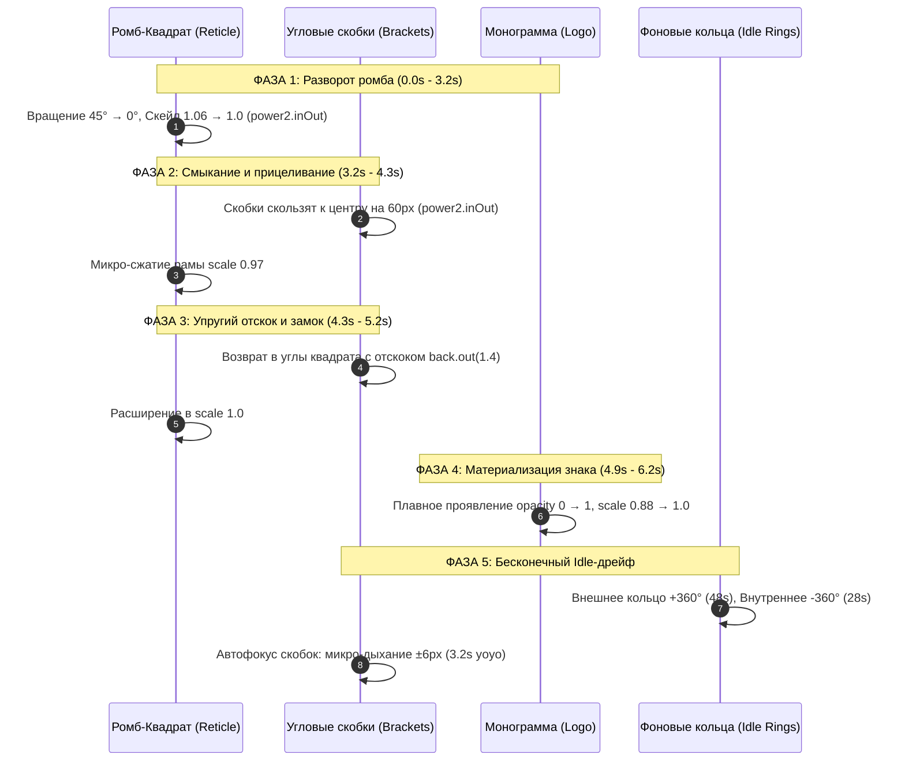

# Полная спецификация и руководство по кинетической анимации: «Оптический прицел (Reticle Crosshair) & WebGL-дымка»

Данный документ содержит исчерпывающее техническое описание, математические формулы, физику движения и готовый к внедрению исходный код кинетической анимации оптического прицела с логотипом и фоновым шейдерным туманом (концепция ETLEGIS).

---

## 1. Архитектура и визуальные слои

Анимация построена по принципу наложения четырёх независимых высокопроизводительных слоёв:

```
┌────────────────────────────────────────────────────────┐
│  Слой 4: Контент / Текст / UI интерфейса               │
├────────────────────────────────────────────────────────┤
│  Слой 3: Центральная векторная монограмма (SVG)        │
│          + Математическое гармоническое свечение       │
├────────────────────────────────────────────────────────┤
│  Слой 2: Оптический прицел (SVG Reticle Coordinate)    │
│          + Азимутальные кольца, скобки, риски, GSAP    │
├────────────────────────────────────────────────────────┤
│  Слой 1: Фоновая органическая дымка (Three.js + GLSL)  │
│          + Simplex FBM Noise с поправкой аспекта       │
└────────────────────────────────────────────────────────┘
```

### Цветовые палитры

| Элемент | Светлая тема (Light Paper) | Тёмная тема (Dark Indigo) | Золотая тема (Luxury Gold) |
| :--- | :--- | :--- | :--- |
| **Фон** | `#F4F2ED` / `#EFECE6` | `#05080F` / `#0A0E17` | `#080705` / `#0F0D0A` |
| **Внешняя рама / скобки** | `#2C3E50` (opacity 0.75) | `#60A5FA` / `#93C5FD` | `#C5A059` / `#E0BE7E` |
| **Кольца и вспомогательные риски**| `#3E5871` (opacity 0.45) | `rgba(255,255,255,0.2)` | `rgba(197,160,89,0.3)` |
| **Монограмма / Знак** | `#7A8A9E` (без блюра) | `#FFFFFF` (+ Blue Glow) | `#FFFFFF` (+ Gold Glow) |

---

## 2. Кинематика и фазы движения (GSAP Timeline)

Таймлайн анимации состоит из **вводной кинетической секвенции захвата цели** (~6.2 секунды) и последующего **бесконечного режима фонового ожидания (Idle)**.



### Формула органического мерцания свечения (Multi-frequency Wave)
Интенсивность свечения вычисляется на каждом кадре `requestAnimationFrame`:
$$\mathcal{I}(t) = 0.60 + 0.35 \times \left(0.40 \sin(0.7t) + 0.30 \sin(1.9t + 1.2) + 0.15 \sin(3.1t + 0.5)\right)$$
Это исключает механическую цикличность и создает ощущение живого аналогового тока.

---

## 3. Вариант 1: Полный автономный HTML-файл (Вставить куда угодно)

Сохраните следующий код в файл `.html` и откройте в любом браузере. Зависимости подключаются через быстрые CDN (Three.js и GSAP).

```html
<!DOCTYPE html>
<html lang="ru">
<head>
  <meta charset="UTF-8">
  <meta name="viewport" content="width=device-width, initial-scale=1.0">
  <title>Kinetic Reticle & WebGL Smoke</title>
  <style>
    *, *::before, *::after {
      box-sizing: border-box;
      margin: 0;
      padding: 0;
    }

    body {
      background: #F4F2ED;
      color: #2C3E50;
      font-family: -apple-system, BlinkMacSystemFont, "Segoe UI", Roboto, sans-serif;
      overflow: hidden;
      width: 100vw;
      height: 100vh;
      display: flex;
      align-items: center;
      justify-content: center;
    }

    /* Контейнер фона WebGL */
    #smoke-canvas-container {
      position: absolute;
      inset: 0;
      z-index: 1;
      pointer-events: none;
    }

    /* Контейнер прицела */
    .reticle-stage {
      position: relative;
      z-index: 2;
      width: min(85vw, 560px);
      height: min(85vw, 560px);
      display: flex;
      align-items: center;
      justify-content: center;
      cursor: pointer;
      user-select: none;
    }

    .reticle-svg {
      width: 100%;
      height: 100%;
      overflow: visible;
    }

    /* Ореол мягкого свечения вокруг центра */
    .ambient-halo {
      position: absolute;
      width: 320px;
      height: 320px;
      border-radius: 50%;
      background: radial-gradient(circle, rgba(146, 123, 80, 0.18) 0%, rgba(80, 113, 146, 0.08) 50%, transparent 75%);
      filter: blur(40px);
      pointer-events: none;
      z-index: 1;
      transform: scale(0.9);
      opacity: 0.5;
    }
  </style>

  <!-- Внешние библиотеки -->
  <script src="https://cdnjs.cloudflare.com/ajax/libs/three.js/r128/three.min.js"></script>
  <script src="https://cdnjs.cloudflare.com/ajax/libs/gsap/3.12.5/gsap.min.js"></script>
</head>
<body>

  <!-- Слой 1: Three.js холст для дымки -->
  <div id="smoke-canvas-container"></div>

  <!-- Слой 2 & 3: Оптический прицел + Знак -->
  <div class="reticle-stage" id="reticleStage" title="Нажмите для повторной калибровки">
    <div class="ambient-halo" id="ambientHalo"></div>

    <svg class="reticle-svg" viewBox="0 0 600 600" xmlns="http://www.w3.org/2000/svg">
      <!-- Направляющие экранные оси -->
      <g stroke="#3E5871" stroke-width="1" opacity="0.35" stroke-dasharray="3 5">
        <line x1="300" y1="20" x2="300" y2="70" />
        <line x1="300" y1="530" x2="300" y2="580" />
        <line x1="20" y1="300" x2="70" y2="300" />
        <line x1="530" y1="300" x2="580" y2="300" />
      </g>

      <!-- Единая центрированная система координат (0,0) в точке (300, 300) -->
      <g transform="translate(300, 300)">
        
        <!-- Внешнее азимутальное кольцо (медленно вращается по часовой стрелке) -->
        <g id="outerRing">
          <circle cx="0" cy="0" r="260" fill="none" stroke="#507192" stroke-width="0.85" stroke-dasharray="2 12" opacity="0.5" />
          <circle cx="0" cy="0" r="220" fill="none" stroke="#507192" stroke-width="0.6" stroke-dasharray="4 20" opacity="0.4" />
          <g stroke="#507192" stroke-width="1" opacity="0.55">
            <line x1="0" y1="-264" x2="0" y2="-252" />
            <line x1="0" y1="252" x2="0" y2="264" />
            <line x1="-264" y1="0" x2="-252" y2="0" />
            <line x1="252" y1="0" x2="264" y2="0" />
            <line x1="-184" y1="-184" x2="-175" y2="-175" />
            <line x1="184" y1="-184" x2="175" y2="-175" />
            <line x1="-184" y1="184" x2="-175" y2="175" />
            <line x1="184" y1="184" x2="175" y2="175" />
          </g>
        </g>

        <!-- Кинетическая группа (стартует ромбом 45°, трансформируется в квадрат 0°) -->
        <g id="reticleGroup">
          <!-- Внешняя квадратная рама 400x400 -->
          <rect x="-200" y="-200" width="400" height="400" fill="none" stroke="#2C3E50" stroke-width="1.3" stroke-dasharray="6 8" opacity="0.65" />
          
          <!-- Внутренняя проверочная рамка 280x280 -->
          <rect x="-140" y="-140" width="280" height="280" fill="none" stroke="#507192" stroke-width="0.8" stroke-dasharray="4 10" opacity="0.45" />

          <!-- Внутреннее оптическое кольцо (противовращение против часовой стрелки) -->
          <g id="innerRing">
            <circle cx="0" cy="0" r="170" fill="none" stroke="#927B50" stroke-width="0.85" stroke-dasharray="4 14" opacity="0.5" />
            <circle cx="0" cy="0" r="70" fill="none" stroke="#507192" stroke-width="0.75" stroke-dasharray="3 6" opacity="0.45" />
            <g stroke="#927B50" stroke-width="1" opacity="0.55">
              <line x1="0" y1="-176" x2="0" y2="-164" />
              <line x1="0" y1="164" x2="0" y2="176" />
              <line x1="-176" y1="0" x2="-164" y2="0" />
              <line x1="164" y1="0" x2="176" y2="0" />
            </g>
          </g>

          <!-- Осевые крестовины -->
          <g stroke="#3E5871" stroke-width="0.75" opacity="0.4">
            <line x1="-140" y1="0" x2="-70" y2="0" />
            <line x1="70" y1="0" x2="140" y2="0" />
            <line x1="0" y1="-140" x2="0" y2="-70" />
            <line x1="0" y1="70" x2="0" y2="140" />
          </g>

          <!-- Центральные насечки на гранях квадрата -->
          <g stroke="#2C3E50" stroke-width="1.4" opacity="0.7">
            <line x1="0" y1="-206" x2="0" y2="-194" />
            <line x1="0" y1="194" x2="0" y2="206" />
            <line x1="-206" y1="0" x2="-194" y2="0" />
            <line x1="194" y1="0" x2="206" y2="0" />
          </g>

          <!-- 4 Угловые скобки (Кинетические визиры) -->
          <g id="bracketsGroup">
            <!-- Верхняя левая -->
            <path id="bracketTL" d="M -200 -120 L -200 -200 L -120 -200" fill="none" stroke="#2C3E50" stroke-width="1.5" stroke-linecap="square" />
            <!-- Верхняя правая -->
            <path id="bracketTR" d="M 120 -200 L 200 -200 L 200 -120" fill="none" stroke="#2C3E50" stroke-width="1.5" stroke-linecap="square" />
            <!-- Нижняя левая -->
            <path id="bracketBL" d="M -200 120 L -200 200 L -120 200" fill="none" stroke="#2C3E50" stroke-width="1.5" stroke-linecap="square" />
            <!-- Нижняя правая -->
            <path id="bracketBR" d="M 120 200 L 200 200 L 200 120" fill="none" stroke="#2C3E50" stroke-width="1.5" stroke-linecap="square" />
          </g>
        </g>

        <!-- Монограмма по центру (Мягкий серый цвет #BEC4CD) -->
        <g id="monogramGroup" opacity="0">
          <g transform="scale(2.35) translate(-62.95, -62.35)">
            <path fill="#BEC4CD" d="M113.4,31.3V11.9H35.8v19.4H12.5v81.5H94V89.5h19.4V70.1H55.2V58.4h58.2V42.9H55.2V31.3H113.4z M86.2,89.5V105h-66V39h15.5v50.4H86.2z" />
          </g>
        </g>

      </g>
    </svg>
  </div>

  <script>
    /* =========================================================================
       1. ШЕЙДЕРНАЯ ДЫМКА НА THREE.JS (Simplex Noise FBM)
       ========================================================================= */
    (function initSmoke() {
      const container = document.getElementById('smoke-canvas-container');
      const width = window.innerWidth;
      const height = window.innerHeight;

      const scene = new THREE.Scene();
      const camera = new THREE.OrthographicCamera(-1, 1, 1, -1, 0, 1);

      let renderer;
      try {
        renderer = new THREE.WebGLRenderer({ antialias: false, powerPreference: "high-performance" });
        renderer.setPixelRatio(Math.min(window.devicePixelRatio || 1, 1.5));
        renderer.setSize(width, height);
        container.appendChild(renderer.domElement);
      } catch (e) {
        console.warn('WebGL is not available:', e);
        return;
      }

      const uniforms = {
        u_time: { value: 0.0 },
        u_resolution: { value: new THREE.Vector2(width, height) }
      };

      const fragmentShader = `
        precision mediump float;
        uniform float u_time;
        uniform vec2 u_resolution;

        vec3 mod289(vec3 x) { return x - floor(x * (1.0 / 289.0)) * 289.0; }
        vec2 mod289(vec2 x) { return x - floor(x * (1.0 / 289.0)) * 289.0; }
        vec3 permute(vec3 x) { return mod289(((x*34.0)+1.0)*x); }

        float snoise(vec2 v) {
            const vec4 C = vec4(0.211324865405187, 0.366025403784439, -0.577350269189626, 0.024390243902439);
            vec2 i  = floor(v + dot(v, C.yy) );
            vec2 x0 = v -   i + dot(i, C.xx);
            vec2 i1 = (x0.x > x0.y) ? vec2(1.0, 0.0) : vec2(0.0, 1.0);
            vec4 x12 = x0.xyxy + C.xxzz;
            x12.xy -= i1;
            i = mod289(i);
            vec3 p = permute( permute( i.y + vec3(0.0, i1.y, 1.0 )) + i.x + vec3(0.0, i1.x, 1.0 ));
            vec3 m = max(0.5 - vec3(dot(x0,x0), dot(x12.xy,x12.xy), dot(x12.zw,x12.zw)), 0.0);
            m = m*m; m = m*m;
            vec3 x = 2.0 * fract(p * C.www) - 1.0;
            vec3 h = abs(x) - 0.5;
            vec3 ox = floor(x + 0.5);
            vec3 a0 = x - ox;
            m *= 1.79284291400159 - 0.85373472095314 * ( a0*a0 + h*h );
            vec3 g;
            g.x  = a0.x  * x0.x  + h.x  * x0.y;
            g.yz = a0.yz * x12.xz + h.yz * x12.yw;
            return 130.0 * dot(m, g);
        }

        void main() {
            vec2 uv = gl_FragCoord.xy / u_resolution.xy;
            uv.x *= u_resolution.x / u_resolution.y;

            // Медленный крупномасштабный ветер
            float slowTime = u_time * 0.08;
            vec2 distUV = uv * 0.45 + vec2(slowTime, slowTime * 0.65);
            float dist = snoise(distUV);

            // Основная слоистая дымка (FBM)
            vec2 smokeUV = uv * 0.95 + vec2(dist * 0.35, -slowTime * 1.1);
            float n1 = snoise(smokeUV);
            float n2 = snoise(smokeUV * 2.1 + vec2(slowTime * 0.5, 0.0));
            float smoke = n1 * 0.65 + n2 * 0.35;
            smoke = clamp((smoke + 0.25) * 0.5, 0.0, 1.0);

            // Светлая бумажная палитра (#F4F2ED в основе)
            vec3 paperBase = vec3(0.957, 0.949, 0.929);
            vec3 smokeDeep = vec3(0.910, 0.898, 0.875);
            vec3 finalColor = mix(paperBase, smokeDeep, smoke * 0.45);

            gl_FragColor = vec4(finalColor, 1.0);
        }
      `;

      const material = new THREE.ShaderMaterial({
        uniforms,
        fragmentShader,
        vertexShader: `void main() { gl_Position = vec4(position, 1.0); }`
      });

      const mesh = new THREE.Mesh(new THREE.PlaneGeometry(2, 2), material);
      scene.add(mesh);

      function animate(time) {
        uniforms.u_time.value = time * 0.001;
        renderer.render(scene, camera);
        requestAnimationFrame(animate);
      }
      requestAnimationFrame(animate);

      window.addEventListener('resize', () => {
        const w = window.innerWidth;
        const h = window.innerHeight;
        renderer.setSize(w, h);
        uniforms.u_resolution.value.set(w, h);
      });
    })();

    /* =========================================================================
       2. GSAP КИНЕТИЧЕСКИЙ ТАЙМЛАЙН ПРИЦЕЛА
       ========================================================================= */
    const reticleGroup = document.getElementById('reticleGroup');
    const outerRing = document.getElementById('outerRing');
    const innerRing = document.getElementById('innerRing');
    const bTL = document.getElementById('bracketTL');
    const bTR = document.getElementById('bracketTR');
    const bBL = document.getElementById('bracketBL');
    const bBR = document.getElementById('bracketBR');
    const monogram = document.getElementById('monogramGroup');
    const halo = document.getElementById('ambientHalo');

    let masterTL = null;
    let idleTL = null;

    // Режим бесконечного ожидания (Idle)
    function startIdleMode() {
      if (idleTL) idleTL.kill();
      idleTL = gsap.timeline();

      // Вращение колец по и против часовой стрелки
      idleTL.to(outerRing, { rotation: "+=360", duration: 48, ease: "none", repeat: -1, transformOrigin: "50% 50%" }, 0);
      idleTL.to(innerRing, { rotation: "-=360", duration: 28, ease: "none", repeat: -1, transformOrigin: "50% 50%" }, 0);

      // Дыхание скобок (микро-фокус)
      idleTL.to(bTL, { x: -6, y: -6, duration: 3.2, ease: "sine.inOut", yoyo: true, repeat: -1 }, 0);
      idleTL.to(bTR, { x: 6, y: -6, duration: 3.2, ease: "sine.inOut", yoyo: true, repeat: -1 }, 0);
      idleTL.to(bBL, { x: -6, y: 6, duration: 3.2, ease: "sine.inOut", yoyo: true, repeat: -1 }, 0);
      idleTL.to(bBR, { x: 6, y: 6, duration: 3.2, ease: "sine.inOut", yoyo: true, repeat: -1 }, 0);
    }

    // Полный цикл калибровки прицела
    function runCalibration() {
      if (idleTL) idleTL.kill();
      if (masterTL) masterTL.kill();

      // Сброс в исходное состояние (Ромб 45 градусов, скрытый знак)
      gsap.set(monogram, { opacity: 0, scale: 0.88, transformOrigin: "50% 50%" });
      gsap.set(reticleGroup, { rotation: 45, scale: 1.06, opacity: 0.85, transformOrigin: "50% 50%" });
      gsap.set(outerRing, { rotation: -45, transformOrigin: "50% 50%" });
      gsap.set(innerRing, { rotation: 0, transformOrigin: "50% 50%" });
      gsap.set([bTL, bTR, bBL, bBR], { x: 0, y: 0 });
      gsap.set(halo, { scale: 0.85, opacity: 0.35 });

      masterTL = gsap.timeline({
        onComplete: () => {
          gsap.set(monogram, { opacity: 1, scale: 1 });
          startIdleMode();
        }
      });

      // ФАЗА 1: «Как на водице» — плавное превращение ромба в квадрат (0.0s -> 3.2s)
      masterTL.to(reticleGroup, { rotation: 0, scale: 1.0, opacity: 1, duration: 3.2, ease: "power2.inOut", transformOrigin: "50% 50%" }, 0);
      masterTL.to(outerRing, { rotation: 0, duration: 3.2, ease: "power2.inOut", transformOrigin: "50% 50%" }, 0);

      // ФАЗА 2: Смыкание скобок к центру (3.2s -> 4.3s)
      masterTL.to(bTL, { x: 60, y: 60, duration: 1.1, ease: "power2.inOut" }, 3.2);
      masterTL.to(bTR, { x: -60, y: 60, duration: 1.1, ease: "power2.inOut" }, 3.2);
      masterTL.to(bBL, { x: 60, y: -60, duration: 1.1, ease: "power2.inOut" }, 3.2);
      masterTL.to(bBR, { x: -60, y: -60, duration: 1.1, ease: "power2.inOut" }, 3.2);
      masterTL.to(reticleGroup, { scale: 0.97, duration: 1.1, ease: "power2.inOut", transformOrigin: "50% 50%" }, 3.2);

      // ФАЗА 3: Упругий замок с отскоком back.out(1.4) (4.3s -> 5.2s)
      masterTL.to([bTL, bTR, bBL, bBR], { x: 0, y: 0, duration: 0.9, ease: "back.out(1.4)" }, 4.3);
      masterTL.to(reticleGroup, { scale: 1.0, duration: 0.8, ease: "power2.out", transformOrigin: "50% 50%" }, 4.3);
      masterTL.to(halo, { scale: 1.25, opacity: 0.75, duration: 0.5, yoyo: true, repeat: 1, ease: "power2.out" }, 4.3);

      // ФАЗА 4: Плавное рождение монограммы в центре (4.9s -> 6.2s)
      masterTL.to(monogram, { opacity: 1, scale: 1.0, duration: 1.3, ease: "power2.out", transformOrigin: "50% 50%" }, 4.9);
    }

    // Запуск при старте страницы
    runCalibration();

    // Клик по прицелу перезапускает калибровку
    document.getElementById('reticleStage').addEventListener('click', runCalibration);
  </script>
</body>
</html>
```

---

## 4. Вариант 2: Готовый React / Next.js компонент (`HeroReticle.tsx`)

Если вы используете современный стек (Next.js, Vite + React, Nuxt), создайте файл компонента:

```tsx
"use client";

import React, { useEffect, useRef } from "react";
import * as THREE from "three";
import gsap from "gsap";

interface HeroReticleProps {
  theme?: "light" | "dark" | "gold";
  className?: string;
}

export function HeroReticle({ theme = "light", className = "" }: HeroReticleProps) {
  const smokeContainerRef = useRef<HTMLDivElement>(null);
  const reticleGroupRef = useRef<SVGGElement>(null);
  const outerRingRef = useRef<SVGGElement>(null);
  const innerRingRef = useRef<SVGGElement>(null);
  const bTlRef = useRef<SVGPathElement>(null);
  const bTrRef = useRef<SVGPathElement>(null);
  const bBlRef = useRef<SVGPathElement>(null);
  const bBrRef = useRef<SVGPathElement>(null);
  const monogramRef = useRef<SVGGElement>(null);
  const haloRef = useRef<HTMLDivElement>(null);

  const masterTlRef = useRef<gsap.core.Timeline | null>(null);
  const idleTlRef = useRef<gsap.core.Timeline | null>(null);

  // Цвета в зависимости от темы
  const isLight = theme === "light";
  const strokeSquare = isLight ? "#2C3E50" : theme === "gold" ? "#C5A059" : "#60A5FA";
  const strokeRings = isLight ? "#507192" : "rgba(255,255,255,0.3)";
  const strokeAccent = isLight ? "#927B50" : theme === "gold" ? "#E0BE7E" : "#93C5FD";
  const monogramColor = isLight ? "#BEC4CD" : "#FFFFFF";

  useEffect(() => {
    // 1. Инициализация Three.js шейдера
    const container = smokeContainerRef.current;
    if (!container) return;

    const width = container.clientWidth || window.innerWidth;
    const height = container.clientHeight || window.innerHeight;

    const scene = new THREE.Scene();
    const camera = new THREE.OrthographicCamera(-1, 1, 1, -1, 0, 1);
    let renderer: THREE.WebGLRenderer;

    try {
      renderer = new THREE.WebGLRenderer({ antialias: false, powerPreference: "high-performance" });
      renderer.setPixelRatio(Math.min(window.devicePixelRatio || 1, 1.5));
      renderer.setSize(width, height);
      container.appendChild(renderer.domElement);
    } catch {
      return;
    }

    const uniforms = {
      u_time: { value: 0.0 },
      u_resolution: { value: new THREE.Vector2(width, height) },
      u_is_light: { value: isLight ? 1.0 : 0.0 }
    };

    const fragmentShader = `
      precision mediump float;
      uniform float u_time;
      uniform vec2 u_resolution;
      uniform float u_is_light;

      vec3 mod289(vec3 x) { return x - floor(x * (1.0 / 289.0)) * 289.0; }
      vec2 mod289(vec2 x) { return x - floor(x * (1.0 / 289.0)) * 289.0; }
      vec3 permute(vec3 x) { return mod289(((x*34.0)+1.0)*x); }

      float snoise(vec2 v) {
          const vec4 C = vec4(0.211324865405187, 0.366025403784439, -0.577350269189626, 0.024390243902439);
          vec2 i  = floor(v + dot(v, C.yy) );
          vec2 x0 = v -   i + dot(i, C.xx);
          vec2 i1 = (x0.x > x0.y) ? vec2(1.0, 0.0) : vec2(0.0, 1.0);
          vec4 x12 = x0.xyxy + C.xxzz;
          x12.xy -= i1;
          i = mod289(i);
          vec3 p = permute( permute( i.y + vec3(0.0, i1.y, 1.0 )) + i.x + vec3(0.0, i1.x, 1.0 ));
          vec3 m = max(0.5 - vec3(dot(x0,x0), dot(x12.xy,x12.xy), dot(x12.zw,x12.zw)), 0.0);
          m = m*m; m = m*m;
          vec3 x = 2.0 * fract(p * C.www) - 1.0;
          vec3 h = abs(x) - 0.5;
          vec3 ox = floor(x + 0.5);
          vec3 a0 = x - ox;
          m *= 1.79284291400159 - 0.85373472095314 * ( a0*a0 + h*h );
          vec3 g;
          g.x  = a0.x  * x0.x  + h.x  * x0.y;
          g.yz = a0.yz * x12.xz + h.yz * x12.yw;
          return 130.0 * dot(m, g);
      }

      void main() {
          vec2 uv = gl_FragCoord.xy / u_resolution.xy;
          uv.x *= u_resolution.x / u_resolution.y;

          float slowTime = u_time * 0.08;
          vec2 distUV = uv * 0.45 + vec2(slowTime, slowTime * 0.65);
          float dist = snoise(distUV);

          vec2 smokeUV = uv * 0.95 + vec2(dist * 0.35, -slowTime * 1.1);
          float smoke = snoise(smokeUV) * 0.65 + snoise(smokeUV * 2.1) * 0.35;
          smoke = clamp((smoke + 0.25) * 0.5, 0.0, 1.0);

          if (u_is_light > 0.5) {
              vec3 paper = vec3(0.957, 0.949, 0.929);
              vec3 shade = vec3(0.910, 0.898, 0.875);
              gl_FragColor = vec4(mix(paper, shade, smoke * 0.45), 1.0);
          } else {
              vec3 darkBase = vec3(0.02, 0.03, 0.06);
              vec3 darkSmoke = vec3(0.08, 0.12, 0.22);
              gl_FragColor = vec4(mix(darkBase, darkSmoke, smoke * 0.6), 1.0);
          }
      }
    `;

    const material = new THREE.ShaderMaterial({
      uniforms,
      fragmentShader,
      vertexShader: `void main() { gl_Position = vec4(position, 1.0); }`
    });

    const mesh = new THREE.Mesh(new THREE.PlaneGeometry(2, 2), material);
    scene.add(mesh);

    let frameId: number;
    const renderLoop = (time: number) => {
      uniforms.u_time.value = time * 0.001;
      renderer.render(scene, camera);
      frameId = requestAnimationFrame(renderLoop);
    };
    frameId = requestAnimationFrame(renderLoop);

    const onResize = () => {
      const w = container.clientWidth || window.innerWidth;
      const h = container.clientHeight || window.innerHeight;
      renderer.setSize(w, h);
      uniforms.u_resolution.value.set(w, h);
    };
    window.addEventListener("resize", onResize);

    // 2. GSAP Анимация прицела
    const startIdle = () => {
      if (idleTlRef.current) idleTlRef.current.kill();
      const tl = gsap.timeline();

      if (outerRingRef.current) {
        tl.to(outerRingRef.current, { rotation: "+=360", duration: 48, ease: "none", repeat: -1, transformOrigin: "50% 50%" }, 0);
      }
      if (innerRingRef.current) {
        tl.to(innerRingRef.current, { rotation: "-=360", duration: 28, ease: "none", repeat: -1, transformOrigin: "50% 50%" }, 0);
      }
      if (bTlRef.current && bTrRef.current && bBlRef.current && bBrRef.current) {
        tl.to(bTlRef.current, { x: -6, y: -6, duration: 3.2, ease: "sine.inOut", yoyo: true, repeat: -1 }, 0);
        tl.to(bTrRef.current, { x: 6, y: -6, duration: 3.2, ease: "sine.inOut", yoyo: true, repeat: -1 }, 0);
        tl.to(bBlRef.current, { x: -6, y: 6, duration: 3.2, ease: "sine.inOut", yoyo: true, repeat: -1 }, 0);
        tl.to(bBrRef.current, { x: 6, y: 6, duration: 3.2, ease: "sine.inOut", yoyo: true, repeat: -1 }, 0);
      }
      idleTlRef.current = tl;
    };

    const runSequence = () => {
      if (idleTlRef.current) idleTlRef.current.kill();
      if (masterTlRef.current) masterTlRef.current.kill();

      const reticle = reticleGroupRef.current;
      const outer = outerRingRef.current;
      const inner = innerRingRef.current;
      const logo = monogramRef.current;
      const halo = haloRef.current;
      const brackets = [bTlRef.current, bTrRef.current, bBlRef.current, bBrRef.current].filter(Boolean);

      if (!reticle || brackets.length < 4) return;

      gsap.set(logo, { opacity: 0, scale: 0.88, transformOrigin: "50% 50%" });
      gsap.set(reticle, { rotation: 45, scale: 1.06, opacity: 0.85, transformOrigin: "50% 50%" });
      if (outer) gsap.set(outer, { rotation: -45, transformOrigin: "50% 50%" });
      if (inner) gsap.set(inner, { rotation: 0, transformOrigin: "50% 50%" });
      gsap.set(brackets, { x: 0, y: 0 });
      if (halo) gsap.set(halo, { scale: 0.85, opacity: 0.35 });

      const tl = gsap.timeline({
        onComplete: () => {
          gsap.set(logo, { opacity: 1, scale: 1 });
          startIdle();
        }
      });

      tl.to(reticle, { rotation: 0, scale: 1.0, opacity: 1, duration: 3.2, ease: "power2.inOut", transformOrigin: "50% 50%" }, 0);
      if (outer) tl.to(outer, { rotation: 0, duration: 3.2, ease: "power2.inOut", transformOrigin: "50% 50%" }, 0);

      tl.to(bTlRef.current, { x: 60, y: 60, duration: 1.1, ease: "power2.inOut" }, 3.2);
      tl.to(bTrRef.current, { x: -60, y: 60, duration: 1.1, ease: "power2.inOut" }, 3.2);
      tl.to(bBlRef.current, { x: 60, y: -60, duration: 1.1, ease: "power2.inOut" }, 3.2);
      tl.to(bBrRef.current, { x: -60, y: -60, duration: 1.1, ease: "power2.inOut" }, 3.2);
      tl.to(reticle, { scale: 0.97, duration: 1.1, ease: "power2.inOut", transformOrigin: "50% 50%" }, 3.2);

      tl.to(brackets, { x: 0, y: 0, duration: 0.9, ease: "back.out(1.4)" }, 4.3);
      tl.to(reticle, { scale: 1.0, duration: 0.8, ease: "power2.out", transformOrigin: "50% 50%" }, 4.3);
      if (halo) tl.to(halo, { scale: 1.25, opacity: 0.75, duration: 0.5, yoyo: true, repeat: 1, ease: "power2.out" }, 4.3);

      if (logo) tl.to(logo, { opacity: 1, scale: 1.0, duration: 1.3, ease: "power2.out", transformOrigin: "50% 50%" }, 4.9);

      masterTlRef.current = tl;
    };

    runSequence();

    return () => {
      cancelAnimationFrame(frameId);
      window.removeEventListener("resize", onResize);
      if (masterTlRef.current) masterTlRef.current.kill();
      if (idleTlRef.current) idleTlRef.current.kill();
      renderer.dispose();
    };
  }, [isLight, theme]);

  return (
    <div className={`relative w-full h-full flex items-center justify-center overflow-hidden ${className}`}>
      {/* Three.js холст */}
      <div ref={smokeContainerRef} className="absolute inset-0 pointer-events-none z-0" />

      {/* Ореол */}
      <div
        ref={haloRef}
        className="absolute w-[340px] h-[340px] rounded-full pointer-events-none z-1"
        style={{
          background: isLight
            ? "radial-gradient(circle, rgba(146,123,80,0.18) 0%, rgba(80,113,146,0.08) 50%, transparent 75%)"
            : "radial-gradient(circle, rgba(96,165,250,0.25) 0%, rgba(59,130,246,0.1) 50%, transparent 75%)",
          filter: "blur(40px)"
        }}
      />

      {/* SVG Прицел */}
      <svg
        viewBox="0 0 600 600"
        className="relative z-10 w-full max-w-[560px] h-auto overflow-visible select-none cursor-pointer"
        onClick={() => {
          if (masterTlRef.current && masterTlRef.current.isActive()) return;
          // Повторный запуск при клике
          const event = new CustomEvent("reticle-recalibrate");
          window.dispatchEvent(event);
        }}
      >
        <g stroke={strokeRings} strokeWidth="1" opacity="0.35" strokeDasharray="3 5">
          <line x1="300" y1="20" x2="300" y2="70" />
          <line x1="300" y1="530" x2="300" y2="580" />
          <line x1="20" y1="300" x2="70" y2="300" />
          <line x1="530" y1="300" x2="580" y2="300" />
        </g>

        <g transform="translate(300, 300)">
          <g ref={outerRingRef}>
            <circle cx="0" cy="0" r="260" fill="none" stroke={strokeRings} strokeWidth="0.85" strokeDasharray="2 12" opacity="0.5" />
            <circle cx="0" cy="0" r="220" fill="none" stroke={strokeRings} strokeWidth="0.6" strokeDasharray="4 20" opacity="0.4" />
            <g stroke={strokeRings} strokeWidth="1" opacity="0.55">
              <line x1="0" y1="-264" x2="0" y2="-252" />
              <line x1="0" y1="252" x2="0" y2="264" />
              <line x1="-264" y1="0" x2="-252" y2="0" />
              <line x1="252" y1="0" x2="264" y2="0" />
            </g>
          </g>

          <g ref={reticleGroupRef}>
            <rect x="-200" y="-200" width="400" height="400" fill="none" stroke={strokeSquare} strokeWidth="1.3" strokeDasharray="6 8" opacity="0.65" />
            <rect x="-140" y="-140" width="280" height="280" fill="none" stroke={strokeRings} strokeWidth="0.8" strokeDasharray="4 10" opacity="0.45" />

            <g ref={innerRingRef}>
              <circle cx="0" cy="0" r="170" fill="none" stroke={strokeAccent} strokeWidth="0.85" strokeDasharray="4 14" opacity="0.5" />
              <circle cx="0" cy="0" r="70" fill="none" stroke={strokeRings} strokeWidth="0.75" strokeDasharray="3 6" opacity="0.45" />
            </g>

            <g stroke={strokeSquare} strokeWidth="1.4" opacity="0.7">
              <line x1="0" y1="-206" x2="0" y2="-194" />
              <line x1="0" y1="194" x2="0" y2="206" />
              <line x1="-206" y1="0" x2="-194" y2="0" />
              <line x1="194" y1="0" x2="206" y2="0" />
            </g>

            <g>
              <path ref={bTlRef} d="M -200 -120 L -200 -200 L -120 -200" fill="none" stroke={strokeSquare} strokeWidth="1.5" strokeLinecap="square" />
              <path ref={bTrRef} d="M 120 -200 L 200 -200 L 200 -120" fill="none" stroke={strokeSquare} strokeWidth="1.5" strokeLinecap="square" />
              <path ref={bBlRef} d="M -200 120 L -200 200 L -120 200" fill="none" stroke={strokeSquare} strokeWidth="1.5" strokeLinecap="square" />
              <path ref={bBrRef} d="M 120 200 L 200 200 L 200 120" fill="none" stroke={strokeSquare} strokeWidth="1.5" strokeLinecap="square" />
            </g>
          </g>

          {/* Монограмма */}
          <g ref={monogramRef} opacity="0">
            <g transform="scale(2.35) translate(-62.95, -62.35)">
              <path fill={monogramColor} d="M113.4,31.3V11.9H35.8v19.4H12.5v81.5H94V89.5h19.4V70.1H55.2V58.4h58.2V42.9H55.2V31.3H113.4z M86.2,89.5V105h-66V39h15.5v50.4H86.2z" />
            </g>
          </g>
        </g>
      </svg>
    </div>
  );
}
```

---

## 5. Как адаптировать и вставить под свой логотип / сайт

1. **Как заменить монограмму на собственный логотип**:
   * В блоке `<g id="monogramGroup">` замените элемент `<path d="..." />` на векторный путь вашего логотипа.
   * Рассчитайте Bounding Box вашего SVG (например, через `svgElement.getBBox()`). Если центр вашего логотипа равен `(cx, cy)`, укажите смещение:  
     `transform="scale(S) translate(-cx, -cy)"`. Это гарантирует абсолютное совпадение геометрического центра вашего знака с оптическим перекрестием `(0, 0)`.
2. **Как встроить в Tilda / Webflow / WordPress**:
   * Создайте HTML-блок (или Code Embed).
   * Скопируйте целиком код из **Варианта 1** (включая скрипты Three.js и GSAP).
   * Задайте блоку высоту секции (например, `100vh` или `650px`).
3. **Как изменить цвет линий**:
   * В переменной `stroke="#2C3E50"` замените цвет на фирменный оттенок вашего бренда (например, золотой `#C5A059` или изумрудный `#10B981`).
4. **Производительность**:
   * Шейдер использует `precision mediump` и рендерится с `pixelRatio` не более `1.5`, что обеспечивает 60 FPS даже на смартфонах и дисплеях Retina/4K.
